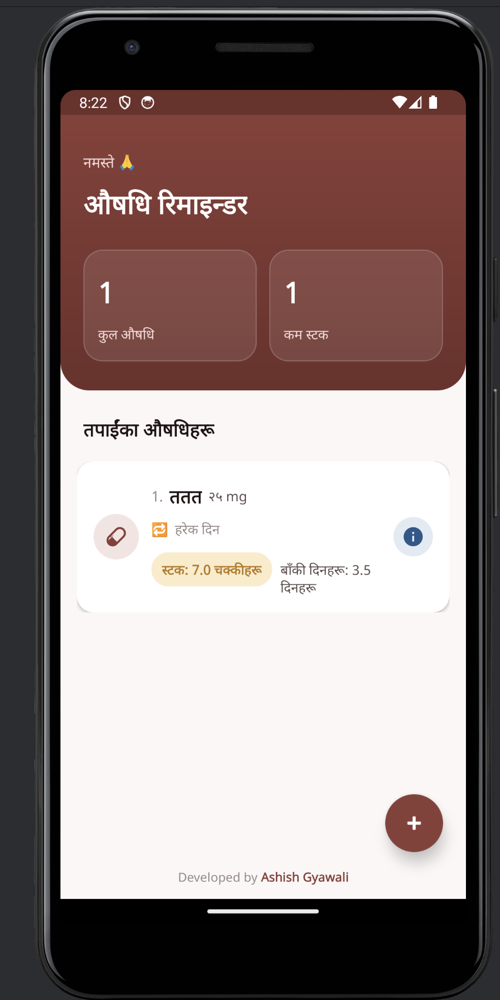
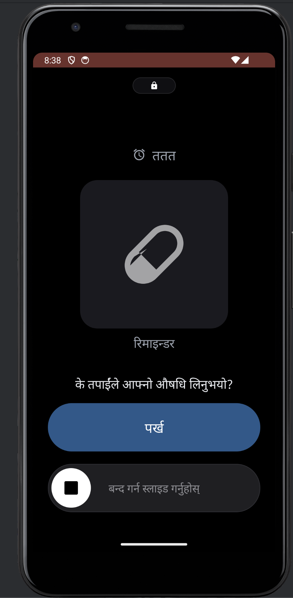

# Medicine Reminder App (औषधि रिमाइन्डर)

A comprehensive and user-friendly Android application designed to help users track their daily medications, manage inventory, and seamlessly calculate future medicine purchase requirements. The app is fully localized in the Nepali language.

## 🚀 Features

- **Smart Reminders:** Reliable, full-screen lock-screen alarms that wake up the device. Includes custom sounds, a "Slide to Stop" confirmation, and a "Snooze" feature.
- **Automated Stock Management:** Automatically deducts medicine stock when a user confirms they have taken their dose.
- **Dynamic Scheduling:** Dynamically adapts the number of daily time pickers based on the user's input for "Daily Consumption".
- **Medicine Purchase Calculator:** Select active medicines, input a target number of days (e.g., 30, 60), and let the app calculate exactly how much stock you need to buy.
- **Export & Share:** Export your medicine purchase lists as **PDF**, **JPEG**, or copy as **Text** to easily share with a pharmacy or family members.
- **Photo Integration:** Add pictures of your medicines by taking a new photo with the camera or choosing one from the gallery.
- **100% Offline & Private:** All data, including images and schedules, is stored locally on your device.

## 📸 Screenshots

| Home / Dashboard | Add Medicine | Lock-Screen Alarm | Purchase Calculator |
| :---: | :---: | :---: | :---: |
|  |  |  |  |

*(Note: Replace `placeholder_home.png`, etc., with the actual image links or paths once uploaded to your repository.)*

## 🛠️ Tech Stack

- **Language:** Java
- **Platform:** Android SDK
- **Database:** Room (SQLite) for robust local data persistence
- **UI Components:** Standard XML Layouts, Material Design (`ShapeableImageView`, `SwitchCompat`)
- **Utilities:** 
  - Native `PdfDocument` and Canvas API for PDF/JPEG generation.
  - `AlarmManager` and `BroadcastReceiver` for exact alarm scheduling.
  - `bikramsambat` library for converting dates to the Nepali calendar.

## ⚙️ Installation & Setup

1. Clone this repository:
   ```bash
   git clone https://github.com/yourusername/MedicineReminderApp.git
   ```
2. Open the project in **Android Studio**.
3. Sync the project with Gradle files.
4. Build and run the app on an Android emulator or a physical device.

## 🔒 Key Permissions Used

To ensure alarms ring precisely and wake up the device, this app requires specific permissions:
- `USE_EXACT_ALARM` & `SCHEDULE_EXACT_ALARM`: To trigger reminders at the exact minute.
- `USE_FULL_SCREEN_INTENT` & `SYSTEM_ALERT_WINDOW`: To display the alarm UI over the lock screen.
- `CAMERA` & `READ_EXTERNAL_STORAGE`: To capture and load medicine images.

## 👨‍💻 Developer

**Ashish Gyawali**
- LinkedIn Profile

## 📄 License

```text
MIT License

Copyright (c) 2024 Ashish Gyawali

Permission is hereby granted, free of charge, to any person obtaining a copy
of this software and associated documentation files (the "Software"), to deal
in the Software without restriction, including without limitation the rights
to use, copy, modify, merge, publish, distribute, sublicense, and/or sell
copies of the Software, and to permit persons to whom the Software is
furnished to do so, subject to the following conditions:

...
```